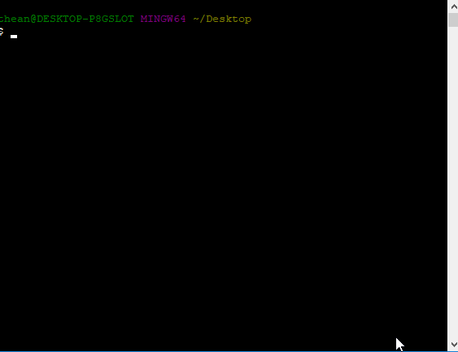
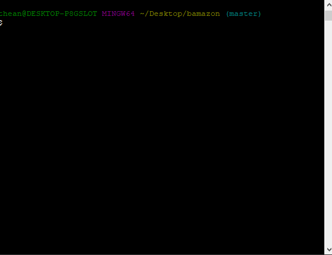

# bAmazon
A node Amazon-like storefront with MySQL.

## Prerequisites

You must have the following installed:

1.  bash

2. git

3. node.js

4. MySQL

## How to install

1. Clone this repository using git. Type the following line in bash.

    `git clone https://github.com/angellugo/bamazon.git`

2. Go inside the bamazon folder using the following in bash.

    `cd bamazon`

3. Install the necessary Node Package Modules (NPMs) by typing the following in bash:

    `npm install`

4. Run the bamazon.sql file inside the MySQL Workbench

### Installation example

## How to run the application
1. Run the application using node with typing the following in bash:

    `node bamazonCustomer.js`

    

